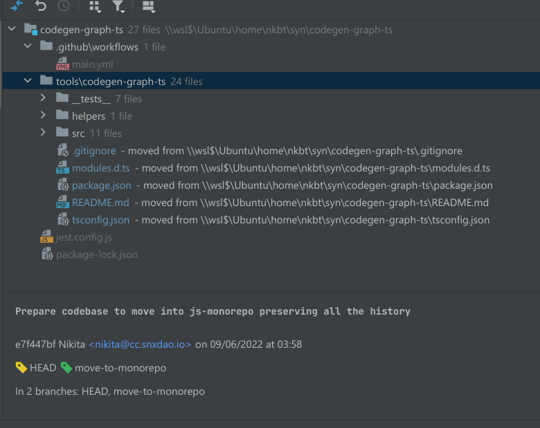
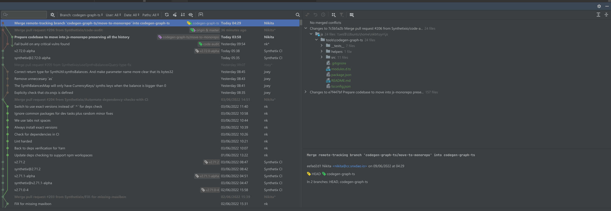

# Synthetix JS - Monorepo

[](https://github.com/synthetixio/js-monorepo/actions/workflows/main.yml)

## Packages

| Package                                                             | Status                                                                                                                                         | Description                           |
| ------------------------------------------------------------------- | ---------------------------------------------------------------------------------------------------------------------------------------------- | ------------------------------------- |
| [`@synthetixio/contracts-interface`](/packages/contracts-interface) | [](https://badge.fury.io/js/@synthetixio%2Fcontracts-interface) | Synthetix contracts interface         |
| [`@synthetixio/queries`](/packages/queries)                         | [](https://badge.fury.io/js/@synthetixio%2Fqueries)                         | React library for querying data       |
| [`@synthetixio/providers`](/packages/providers)                     | [](https://badge.fury.io/js/@synthetixio%2Fproviders)                     | Synthetix providers for layer 1 and 2 |
| [`@synthetixio/optimism-networks`](/packages/optimism-networks)     | [](https://badge.fury.io/js/@synthetixio%2Foptimism-networks)     | Network utility for layer 2           |
| [`@synthetixio/codegen-graph-ts`](/tools/codegen-graph-ts)          | [](https://badge.fury.io/js/@synthetixio%2Fcodegen-graph-ts)       | Query generator                       |
| [`@synthetixio/safe-import`](/tools/safe-import)                    | [](https://badge.fury.io/js/@synthetixio%2Fsafe-import)                 | Async imports with retry              |

## Install

This repo uses Yarn workspaces to manage multiple packages in the same repo. To prepare the repository for use, run:

```
yarn install
```

This will install all dependencies, wire dependencies between packages in this repo, and allow for you to build projects.

## Build

If you make a change and want to generate the library JS code, run:

```
yarn build
```

This will ensure all projects are fully built in topological order. You are also free to run script commands from individual repositories if necessary or desired.

## Publish

Monorepo is now switched to independent versioning so each package inside monorepo can have its own version independently of all others

### Publishing new version after `synthetix` upgrade

We have a GitHub workflow for publishing releases.

To publish:

1. Go here https://github.com/Synthetixio/js-monorepo/actions/workflows/updateDependency.yml
2. Click Run Workflow
3. Fill `synthetix_version` in a format of `1.2.3` for the version
4. Run the workflow

This will upgrade `synthetix` in the monorepo and all affected packages will be published with new `patch` release

For example now only the `@synthetixio/contracts-interface` package depends on `synthetix`, so it will get new `patch` version. But then all the packages that depend on it will get new `patch` version in a cascade (check full list of cascade updates with `yarn deps:version`). So overall these packages will be published:

- `@synthetixio/contracts-interface`
- `@synthetixio/providers`
- `@synthetixio/queries`

### Publishing new version of a single package

We have a GitHub workflow for publishing package releases.

To publish:

1. Go here https://github.com/Synthetixio/js-monorepo/actions/workflows/publishSinglePackage.yml
2. Click Run Workflow
3. Fill `package` in a format of `@synthetixio/wei` for the package name
4. Fill `version` in a format of `1.2.3` (or `patch`, `minor`, `major`) for the package version (optional, default value is `patch`)
5. Run the workflow

_NOTE_: All the packages that depend on `package` will be published with `patch` version automatically.
For example when publishing `@synthetixio/wei` these packages will get updates (check with `yarn deps:version`):

- `@synthetixio/wei`
- `@synthetixio/codegen-graph-ts`
- `@synthetixio/queries`

### Testing release

When you open a PR a dev package will be published automatically when CI passes. The version will be `0.0.0-<git short sha>`

### Manual

Yarn workspaces are specially designed to handle package updates. If you want to push a new release for one or more packages in this repo, run:

1. Firstly set desired versions to updated packages:
   ```sh
   yarn version check --interactive
   ```
2. Then apply new versions
   ```sh
   yarn apply --all
   ```
3. Commit changes
4. And now we can publish all the updated packages
   ```sh
   yarn workspaces foreach --no-private npm publish --tolerate-republish
   ```
5. Yarn will automatically replace all the `workspace:*` versions with appropriate semver on publish.

## Adding external library to the monorepo preserving git history

This is 3-step process:

1. Prepare original repo
2. Add remote to monorepo
3. Merge original repo branch and update build to match monorepo processes

Using `codegen-graph-ts` as an example

### 1. Prepare original repo

- Create a separate branch `move-to-monorepo`
- Create the intended destination folder inside monorepo `mkdir -p tools/codegen-graph-ts`
- Move all the package files into `tools/codegen-graph-ts`
- Remove all the files that won't be used (CI config, lockfile, etc)
- Commit looks like this:

  

### 2. Add remote to monorepo

```sh
cd ~/synthetix/js-monorepo
git remote add codegen-graph-ts ~/synthetix/codegen-graph-ts
git fetch --all

#
git merge codegen-graph-ts/move-to-monorepo --allow-unrelated-histories
```

### 3. Merge original repo branch

Using `--allow-unrelated-histories` allows merging independent git history

```sh
git merge codegen-graph-ts/move-to-monorepo --allow-unrelated-histories
```

Because we moved all the files into the separate folder we have no merge conflicts and at the same time we have full history added to the git tree



Now we can remove remote as it is no longer necessary and cleanup all the added tags too

```sh
git remote remove codegen-graph-ts

# Cleanup all local tags and re-fetch existing tags without just removed `codegen-graph-ts` remote
git tag -l | xargs git tag -d
git fetch --tags
```

### Rebasing unmerged branch

To preserve all the merge commits when rebasing on top of updated master use `--rebase-merges`

```sh
git rebase master --rebase-merge
```

Interactive rebase works too

```sh
git rebase master --rebase-merge --interactive
```
